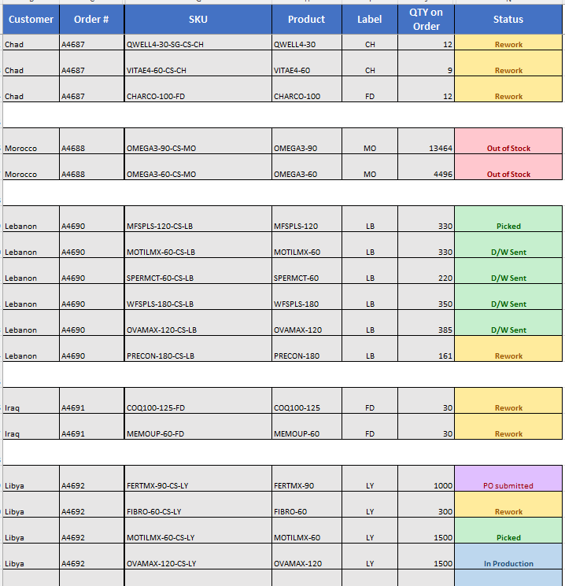
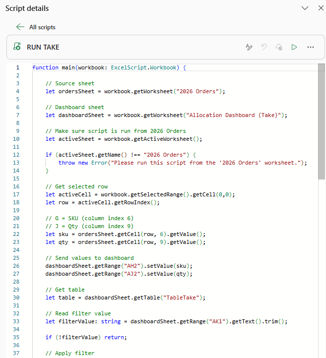
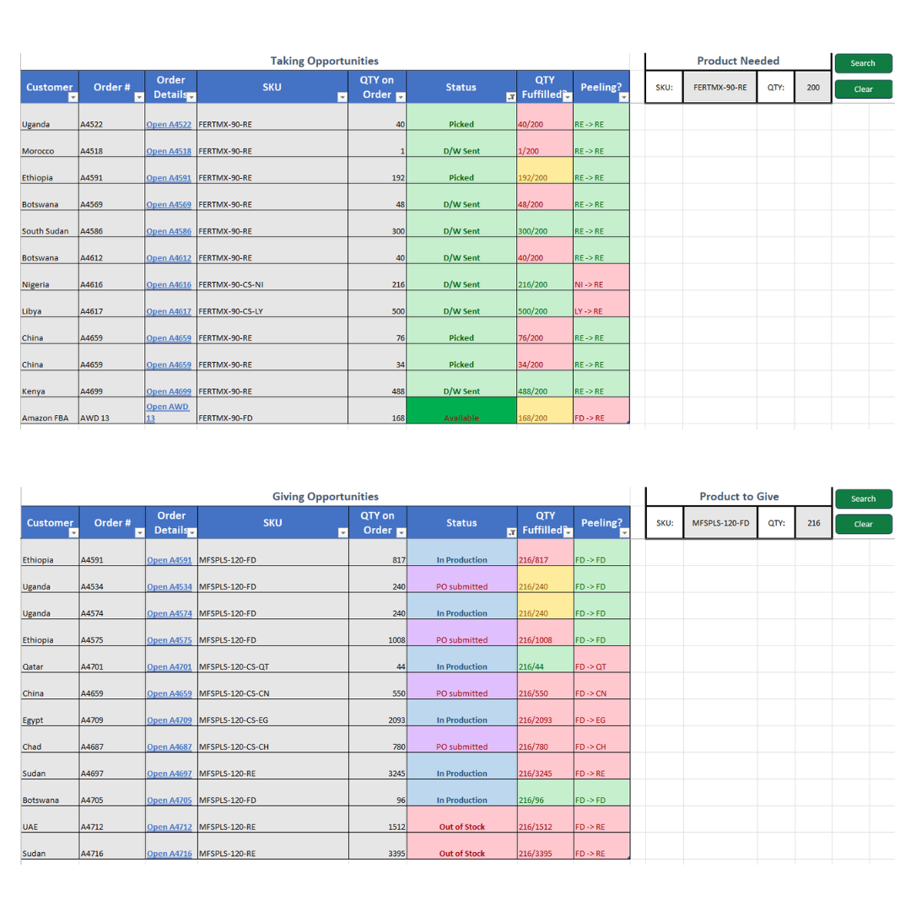

<h1>Product Allocation Dashboard - <a href="./Product Allocation Dashboard.xlsx" download>Sample Excel Sheet</a> </h1>

<h2>Description</h2>
The Product Allocation Dashboard is an Excel-based tool designed to streamline the product allocation process by identifying fulfillment opportunities across existing sales orders. It allows users to search for products that can be allocated from other orders to fulfill shortages or determine whether a product can be reallocated to another order based on demand. The dashboard automatically evaluates available quantities, label compatibility, and fulfillment status to present the most viable allocation options while minimizing unnecessary relabeling and warehouse rework. By consolidating allocation data into a single interface, it reduces manual searching, improves inventory utilization, and enables faster, more informed fulfillment decisions. The tool helps optimize order processing while supporting efficient inventory management across multiple international orders.</a> </h1>
 

<h2>Languages and Utilities Used</h2>

- <b>Excel</b>
- <b>Tables</b>
- <b>Macros/Scripts</b>

  

  <h1>Project Process</h1>

<table width="100%" style="table-layout: fixed;">
  <tr>
    <td align="center" valign="top" width="33%">
      

        
        <b>Data Integration</b>
         
        <h6 style="text-align: center; min-height: 150px; font-size: 2px;">
          Order, inventory, and product data from multiple Excel workbooks were consolidated into a single allocation model. 
             The data was organized and standardized to ensure consistency across product SKUs, quantities, labels, and order status, creating a reliable foundation for the allocation process.
        </h6>
      

    </td>
    <td align="center" valign="top" width="33%">
      

        
        <b>Allocation Engine</b>
        <h6 style="text-align: center; min-height: 150px;">
          Custom business logic was developed to automatically evaluate allocation opportunities between sales orders. 
            The tool analyzes order quantities, label compatibility, and fulfillment status to identify products that can be reallocated while minimizing warehouse rework and unnecessary relabeling.
        </h6>
      

    </td>
    <td align="center" valign="top" width="33%">
      

        
        <b>Decision Dashboard</b>
        <h6 style="text-align: center; min-height: 150px;">
          The processed allocation data is presented through an interactive Excel dashboard that allows users to search for fulfillment opportunities by either taking products from existing orders or giving products to other orders. 
            The dashboard displays the most viable allocation options based on business rules, enabling faster fulfillment decisions, improving inventory utilization, and reducing the manual effort required to evaluate allocation scenarios.
        </h6>
      

    </td>
   
  </tr>
</table>
